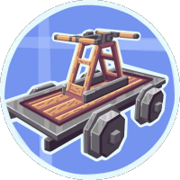

<div align="center">
  
  <h1>Create: Steam 'n' Rails — Create Fly port</h1>
  <p>Steam 'n' Rails for Fabric, Minecraft 26.2, and Create Fly.</p>

[](https://discord.gg/r75NPJWD68) 
</div>

This repository ports [Create: Steam 'n' Rails](https://github.com/Layers-of-Railways/Railway) to [Create Fly](https://github.com/ZurrTum/Create-Fly) for stable Minecraft 26.2. Steam 'n' Rails expands Create's train and steam systems with custom tracks, semaphores, conductors, bogeys, palettes, and other railway content.

The current stable release is **SNR.FLY-STABLE-1.2** for Fabric / Minecraft 26.2. [Download the JAR](https://github.com/cat4blep/Create-Steam-n-Rails-Fly/releases/download/vSNR.FLY-STABLE-1.2/SNR.FLY-STABLE-1.2.jar), read the [1.2 release notes](https://github.com/cat4blep/Create-Steam-n-Rails-Fly/releases/tag/vSNR.FLY-STABLE-1.2), or browse [all releases](https://github.com/cat4blep/Create-Steam-n-Rails-Fly/releases).

> [!IMPORTANT]
> This build targets stable Minecraft **26.2** exactly. The `rc-2` text in the historical Create Fly artifact filename does not change its published Minecraft compatibility metadata, which targets stable 26.2.

## Compatibility

| Component | Required version |
| --- | --- |
| Minecraft | `26.2` exactly |
| Mod loader | Fabric Loader `0.19.3` or newer |
| Fabric API | `0.152.0+26.2` or newer |
| Create | [Create Fly](https://github.com/ZurrTum/Create-Fly) `>=6.0.9-1 <6.0.10-0` |
| Java | 25 |
| This port | `SNR.FLY-STABLE-1.2` |

This is a Fabric-only port. Forge and NeoForge are not supported. Use Create Fly rather than another Create implementation, and do not install the original Steam 'n' Rails JAR alongside this port.

## Installation

1. Install Java 25, Fabric Loader, and Fabric API for Minecraft 26.2.
2. Install a Create Fly build for Minecraft 26.2 within the version range above. Release 1.2 was built against the `26.2-rc-2-6.0.9-1` artifact.
3. Put `SNR.FLY-STABLE-1.2.jar` in the instance's `mods` directory, replacing any older Steam 'n' Rails JAR.
4. Start the game and confirm that Fabric reports `railways`, `create`, and their dependencies as loaded.

For multiplayer, update both the server and all clients to 1.2. This release changes the Railways network protocol from 14 to 15 and synchronizes server settings when joining; local settings are restored when disconnecting.

Back up existing worlds before upgrading the mod or Minecraft.

## Changes in 1.2

- Fixes legacy train data migration with Trinkets Updated ([#9](https://github.com/cat4blep/Create-Steam-n-Rails-Fly/issues/9)), preserving equipment and third-party NBT.
- Removes 611 redundant connected-texture source sheets from the block atlas while retaining generated sprites and source PNGs. If atlas packing still fails, it retries with fewer mip levels, preserving original texture resolution and global graphics settings.
- Fixes rendering of conductor equipment, whistle flags, semaphores and diesel smokestacks, plus quarter-turn rotation of axial smokestacks.
- Reads early options from the current JSON config and safely applies server settings without overwriting client configuration files.
- Rejects unsupported coupler, switch, buffer and whistle interactions on curved track in the active handler.
- Removes expensive whistle route diagnostics and repetitive logging.

See the [changelog](changelog.md) and [release history](https://github.com/cat4blep/Create-Steam-n-Rails-Fly/releases) for more details. Earlier fixes for bogey gauges, monorail geometry, track-switch rendering, phantom textures, train buffers and moving block GUIs are retained.

## Validation and issue reports

Release 1.2 passed all 36 JUnit tests and clean Java 25 builds locally and in [GitHub Actions](https://github.com/cat4blep/Create-Steam-n-Rails-Fly/actions/runs/34023370034), including access-widener and published-namespace checks. Runtime checks covered client resource loading on NVIDIA/OpenGL and server initialization with and without Trinkets Updated `4.1.0-rc.1+26.2`; the server check ended at the first-run EULA gate.

The atlas fix addresses the packing failure reported by AMD/Vulkan users and is tested with Minecraft's actual stitcher. Physical AMD/Vulkan validation and an in-world gameplay session for these fixes remain outstanding. If the fallback is needed, distant texture filtering may use fewer mip levels for the block atlas. Optional third-party integrations and development/datagen paths inherited from the upstream 1.20.x project are not all validated on 26.2.

When [reporting a problem](https://github.com/cat4blep/Create-Steam-n-Rails-Fly/issues), include the complete `latest.log` or crash report, mod versions, a short reproduction sequence, and whether it also occurs with only Steam 'n' Rails and its required dependencies installed. For rendering or atlas issues, also include the GPU, driver version, graphics backend (OpenGL/Vulkan), resource packs, mipmap level and anisotropic filtering setting.

## Building from source

The project uses the included Gradle wrapper and requires JDK 25. Set `JAVA_HOME` to that JDK before building.

Windows PowerShell:

```powershell
./gradlew.bat clean build validateAccessWidener --no-daemon
```

Linux or macOS:

```bash
./gradlew clean build validateAccessWidener --no-daemon
```

The distributable JAR is written to `build/libs/`. Use the JAR without the `-sources` suffix. The first build also downloads the development dependencies and generates the connected-texture sprites used by this port.

### Datagen

For maintainer datagen tasks, set the following environment variable before running the relevant Gradle task:

```env
DATAGEN=TRUE
```

## Contributing

Open an issue before starting a large change so its scope can be agreed on and duplicate work can be avoided. Pull requests should describe the affected Minecraft/Create Fly versions and include the checks used to verify the change.

Branches for this port must be named **exactly** `<modloader>-<version>`, with no additional words or suffixes. The current branch is `fabric-26.2`.

Translations for the upstream project are managed through [Crowdin](https://crowdin.com/project/create-steam-n-rails-official). Translation questions can be asked in the [translator's chat](https://discord.com/channels/706277846389227612/1049156352553000970) on the Steam 'n' Rails Discord.

## License

Steam 'n' Rails is licensed under the LGPL license. See [LICENSE](LICENSE) for details.

Certain sections of the code are derived from projects with compatible licenses, including Create (MIT), Quilt Standard Libraries (Apache-2.0), SecurityCraft (MIT), Neruina (MIT), and FramedBlocks (LGPL). Their copyright and license notices remain applicable to the corresponding code.

## Credits

- [Layers of Railways](https://github.com/Layers-of-Railways/Railway) and its contributors for Create: Steam 'n' Rails.
- [ZurrTum/Create-Fly](https://github.com/ZurrTum/Create-Fly) and its contributors for the Create Fly port used by Minecraft 26.2.
- [chaevsfe/Create-Steam-n-Rails-Fly](https://github.com/chaevsfe/Create-Steam-n-Rails-Fly) for fixes adapted into release 1.2.
- The original Create team and all projects credited in the source and license notices.

We use [YourKit Java Profiler](https://www.yourkit.com/java/profiler/) during mod development and thank YourKit for supporting open-source projects.
